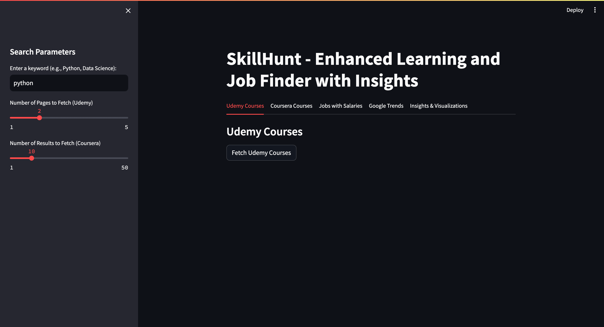
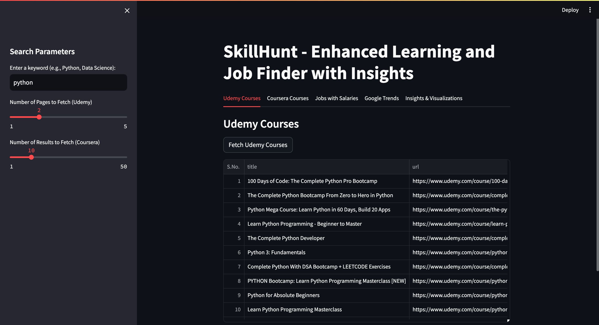
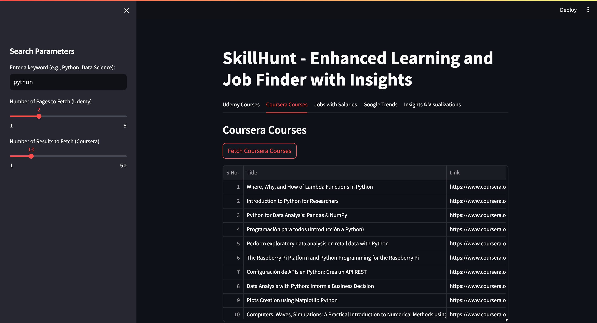
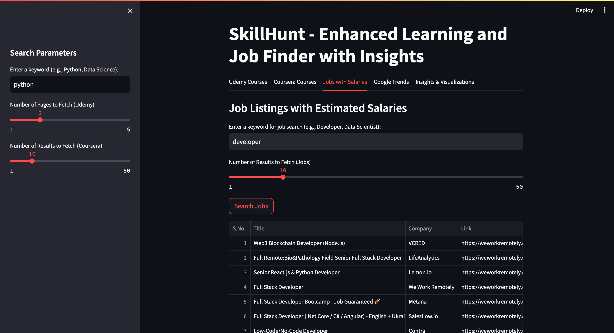
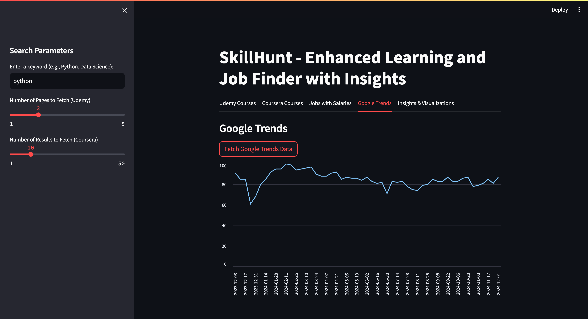
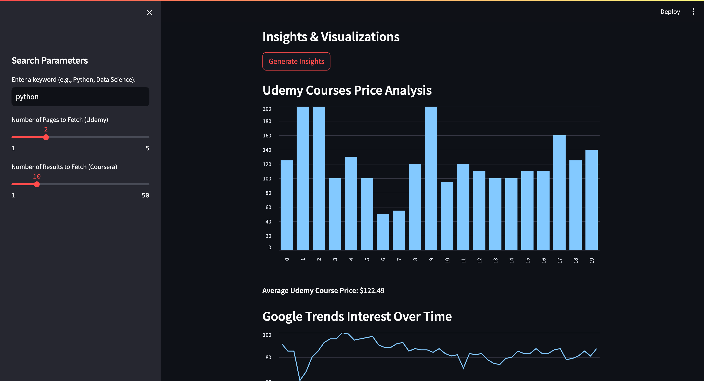

# SKILL HUNT

## Overview
Skill Hunt is an Enhanced Learning and Job Finder application built with Python and Streamlit. It integrates multiple data sources to help users:

1. **Discover Courses**: Search for courses on **Udemy** and **Coursera** based on a specific keyword.
2. **Job Insights**: Explore remote job listings from **We Work Remotely** with estimated salaries.
3. **Google Trends Analysis**: Analyze Google Trends data to visualize the popularity of specific keywords over time.
4. **Data Visualization**: Generate insights such as course price distributions, salary ranges, and combined data trends.

This project demonstrates the use of APIs, web scraping, data cleaning, and visualization techniques to provide actionable insights for professionals and learners.

---

## Features
- **Course Search**: Search for paid courses on Udemy and Coursera by keyword.
- **Job Listings**: Fetch remote job listings along with estimated salary ranges.
- **Google Trends**: Visualize interest trends for keywords over time.
- **Insights**: Interactive visualizations, including price distributions, salary histograms, and combined trends.

---

## Requirements

### Python Environment
Ensure you have Python installed. We recommend **Python 3.8 or higher**.

### Dependencies
Install the following Python packages:
- `streamlit`
- `requests`
- `pandas`
- `matplotlib`
- `beautifulsoup4`
- `pytrends`
- `python-dotenv`

Run the command below to install all required packages:
```bash
pip install -r requirements.txt 
```
## Installation Instructions

1. Download the project as a zip file.
2. Locate the downloaded zip file on your computer.
3. Extract it to a folder of your choice.
4. Navigate to the extracted folder in your terminal or command prompt:
```bash
cd path/to/extracted/folder
```
5. Install the required packages:
```bash
pip install -r requirements.txt 
```

## Running the Application 

1. Run the Streamlit app:
```bash
streamlit run app.py
```
2. Open the URL provided by Streamlit (usually http://localhost:8501) in your browser.

## How to Use
### Search Paramters
1. Keyword Search for Courses:

- Enter a keyword in the "Enter a keyword (e.g., Python, Data Science)" input field under the Search Parameters sidebar.
- Adjust the Number of Pages slider to determine how many pages of Udemy courses to fetch.
2. Separate Job Search:

- Enter a keyword specific to job searches in the "Enter a keyword for job search (e.g., Developer, Data Scientist)" input field in the Jobs with Salaries tab.
- Adjust the Number of Results to Fetch (Jobs) slider to limit the number of job results fetched.
- Click the Search Jobs button to fetch and display job listings.

### Tabs
1. Udemy Courses:

- Fetch and explore Udemy courses related to the entered keyword.
- The fetched results will include course titles, URLs, and prices.

2. Coursera Courses:

- Search for Coursera courses based on the entered keyword.
- Results include course titles and links to the course pages.

3. Jobs with Salaries:

- Use the dedicated job search input to find jobs with estimated salaries based on your entered keyword.
- The fetched results include job titles, company names, URLs, and estimated salary ranges.

4. Google Trends:

- Analyze trends for the entered keyword over the last 12 months using Google Trends data.
- Results are visualized as a line chart showing the popularity of the keyword over time.

5. Insights & Visualizations:

- View combined visualizations for fetched data:
    1. Udemy Course Prices: Distribution of course prices and the average price.
    2. Google Trends: Popularity trends for the entered keyword.
    3. Job Salary Distributions: Histogram of estimated salaries for fetched job listings.
- Get insights into overall data trends and summaries for Udemy, Coursera, and job searches.

### Important Note for the Insights Tab
The **Insights & Visualizations** tab depends on data fetched from all the other tabs. Ensure you have successfully fetched data from:
- Udemy Courses
- Coursera Courses
- Jobs with Salaries
- Google Trends

Only then will the Insights tab be fully functional and display visualizations for the combined data.

If you skip fetching data from any of the tabs, the Insights tab will show warnings or incomplete data.

## Key Code Files
1. Main Application File
- app.py: The main application file integrating all modules and running the Streamlit app.
2. Modules
- udemy.py: Fetches and processes Udemy course data using the Udemy API.
- coursera.py: Fetches and processes Coursera course data using their public API.
- jobs.py: Scrapes job listings from We Work Remotely.
- trends.py: Fetches and visualizes Google Trends data.
- utils.py: Contains helper functions, including salary estimation logic.
3. Environment File
- .env: Stores API credentials for secure access to Udemy API.
4. Dependencies File 
- requirements.txt: Contains all dependencies used for the project and helps in installation and running of the project.

### Screenshots

#### 1. Home Page


#### 2. Udemy Course Search


#### 3. Coursera Course Search

#### 4. Job Listings

#### 5. Google Trends Visualization

#### 6. Insights and Visualizations



## Video Demonstration
A video walkthrough of the application is available here:
YouTube Link

## Group Members
1. Aritra Dutta Andrew ID: adutta
2. Pranav Naik Andrew ID: prnaik
3. Aditya Jadhav Andrew ID: abjadhav
4. Yash Sivramkrishnan Andrew ID: ysivramk


## Notes
- Use previously downloaded data if web scraping or API limits result in delays or errors.
- Ensure Python and Streamlit are installed and running correctly before executing the application.
- Check the requirements.txt file to ensure all dependencies are installed.
- If you encounter an API rate limit, retry after a short delay or reduce the number of fetched pages.